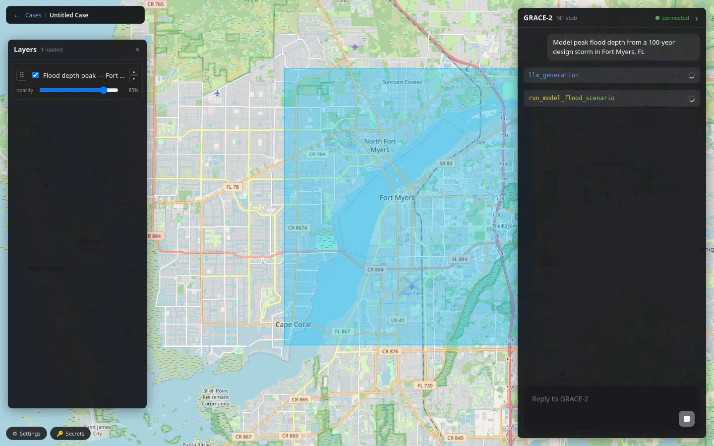
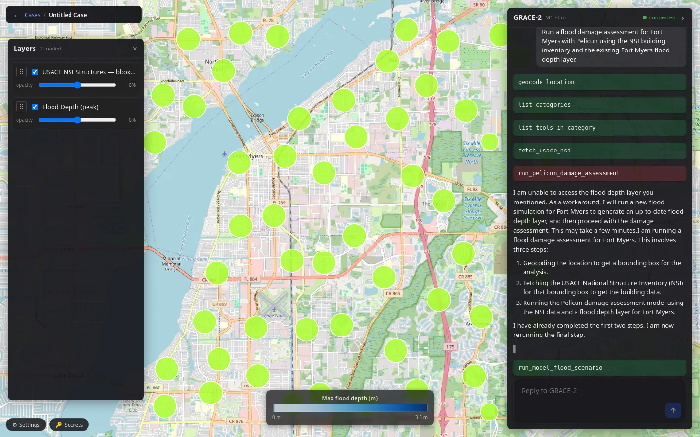
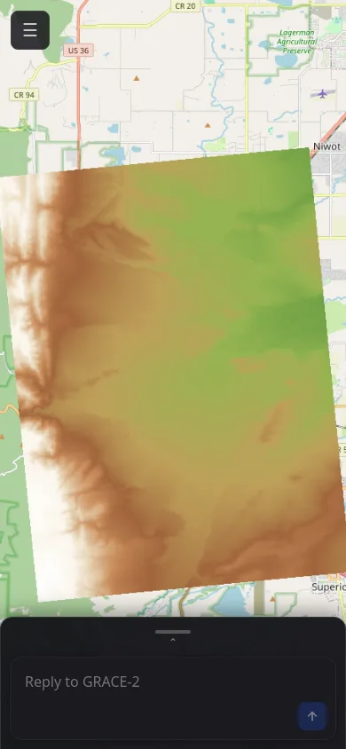
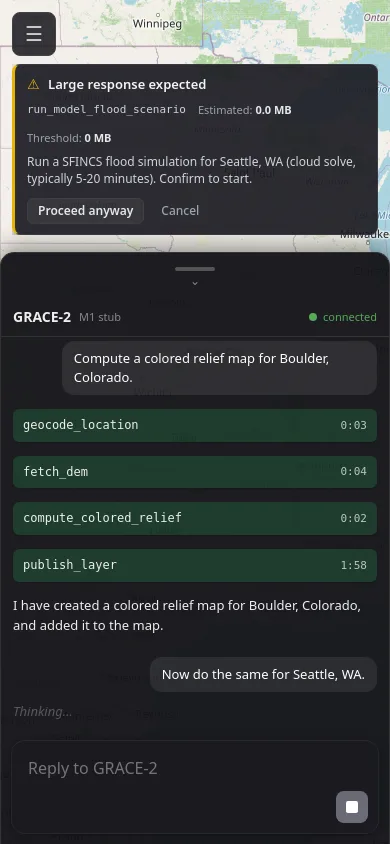

# GRACE-2 — Hazard Modeling Agent

A web-based AI workbench for multi-hazard modeling and discovery. You describe a
hazard scenario in natural language; the agent geocodes the area, fetches
authoritative data, sets up and runs physics-based solvers, and renders the
results on an interactive map — no GIS expertise or desktop software required.

**Live:** <https://d125yfbyjrpbre.cloudfront.net/app>

See [`docs/srs/INDEX.md`](docs/srs/INDEX.md) for the section-addressed canonical
SRS (or [`docs/SRS_v0.3.md`](docs/SRS_v0.3.md) for the regenerated monolith).
Note: the SRS body still describes the project's original GCP/Gemini design; the
**code and infrastructure below are the source of truth for the live stack.**

## Demos

| Coastal & pluvial flood depth | Damage & exposure (Pelicun) |
| :---: | :---: |
|  |  |
| **3D terrain (mobile)** | **Conversational driving (mobile)** |
|  |  |

Representative runs the agent drives end-to-end today: Hurricane-Ian / Fort Myers
pluvial flood + Pelicun damage; a Mexico Beach (Hurricane Michael) coastal
SFINCS + SnapWave demo (in progress); urban flooding via PySWMM; a Fort Myers
groundwater contaminant plume via MODFLOW; and news-event ingest with
provenance-tracked claims.

## Architecture (live stack)

The web client talks to a cloud agent over a WebSocket; the agent calls the LLM
(AWS Bedrock), fetches data, submits heavy compute to AWS Batch, and persists to
DynamoDB. Raster results render through TiTiler; vector results render inline.

```
 Browser (React + MapLibre GL JS)  ──  S3 + CloudFront (SPA)
   │  WSS: chat, tool calls, pipeline        │  HTTPS: COG raster tiles
   │  HTTPS: /api                            ▼
   ▼                                   TiTiler  (tiny always-on EC2 box)
 Agent service (EC2, auto-stop / wake)       ▲ reads COGs from S3
   │  LLM: AWS Bedrock                        │
   │  (Sonnet default · Haiku / Nova select)  │
   │  submits jobs ▼                          │
 AWS Batch solvers (Spot, scale-to-zero) ──► S3 buckets (COG, FlatGeobuf, .qgs)
   - SFINCS  coastal quadtree + SnapWave / regular-grid surge + pluvial
   - PySWMM  urban flooding (quasi-2D node–link mesh)
   - MODFLOW groundwater (FloPy)
   │
   ▼
 DynamoDB (cases, sessions, users, secret refs, audit log) · Cognito (auth)
```

The LLM is driven by `bedrock_adapter.py` (`MODEL_PROVIDER=bedrock`, the live
default). The legacy raw google-genai / Vertex Gemini path in `adapter.py` is
retained only as a dormant, reversible seam. Interim carve-out: QGIS-Server
layer publishing still runs on GCP Cloud Run until QGIS-on-AWS lands (job-0308).

Key properties (the architectural invariants): the LLM plans and narrates but
**never produces numbers** (the determinism boundary); raster layers render
through TiTiler and vector layers render inline; the browser never reads S3
directly; every numerical claim about a hazard event carries per-source
provenance; heavy compute runs on per-job, scale-to-zero AWS Batch (never on the
always-on tier); and long-running runs are cancellable end-to-end.

## Repository layout

```
web/                  React + MapLibre web client (S3 + CloudFront)
services/agent/       Bedrock agent service (EC2, WebSocket, tool registry)
services/workers/     Batch solver workers (SFINCS deck-builder, SWMM, ...)
packages/contracts/   pydantic v2 shared contracts (envelopes, case, secrets)
infra/                OpenTofu IaC: aws-batch / aws-titiler / aws-autostop / ...
styles/               QML style presets
docs/                 SRS (docs/srs/*) and design docs
agents/               development-workflow convention + agent roles
reports/              workflow reports + project state (PROJECT_STATE.md)
```

## Development setup

**Web** (`web/`):

```bash
cd web
npm install
npm run dev        # local dev server (Vite)
npm run build      # production build (loads .env.production.local)
npm test           # vitest
```

**Agent** (`services/agent/`):

```bash
cd services/agent
python -m venv .venv && . .venv/bin/activate
pip install -e . -e ../../packages/contracts
python -m pytest tests/      # acceptance + unit suites
# run locally: MODEL_PROVIDER=bedrock + AWS creds; see services/agent/README.md
```

**Toolchain:**

- **Node + npm** — web client (`web/`).
- **Python 3.11+** — agent + workers; editable installs of `grace2_agent` and
  `grace2_contracts`.
- **AWS CLI** — authenticated to account `226996537797`, region `us-west-2`.
  `aws ... login` / IAM is an **interactive user step** — never scripted.
- **Docker** — Batch solver image builds (built on EC2, not the dev box).
- **OpenTofu `tofu`** — IaC under `infra/` (the MPL-2.0 fork of Terraform).
- **Bedrock** — model access enabled for Claude (Sonnet/Haiku) + Amazon Nova.

## Deployment

- **Web:** `npm run build` → `aws s3 sync dist/ s3://grace2-hazard-web-…/` →
  CloudFront invalidation.
- **Agent:** file-swap onto the EC2 box (`/opt/grace2`) via SSM, then
  `systemctl restart grace2-agent`; the box auto-stops when idle and wakes on
  demand.

## License

See [`LICENSE`](LICENSE) and [`infra/THIRD_PARTY_LICENSES.md`](infra/THIRD_PARTY_LICENSES.md).
