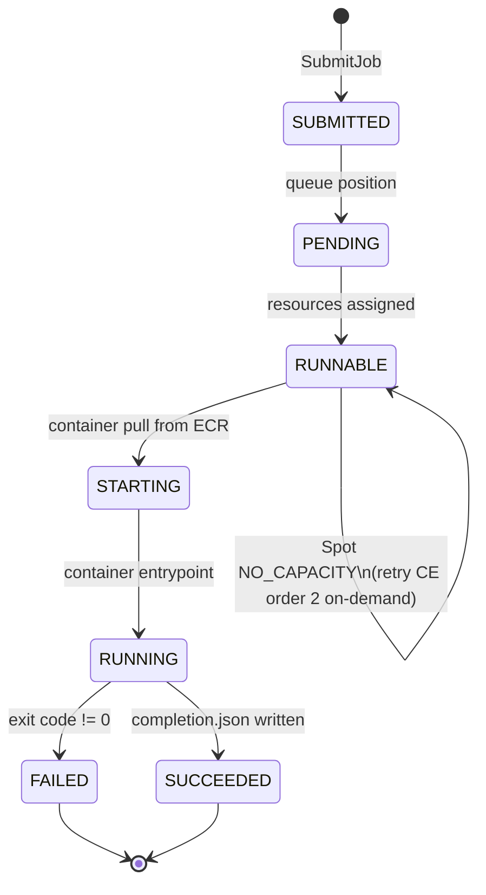

# Compute Tier (AWS Batch)

All heavy simulation work -- model build, numerical solve, and raster postprocessing -- runs in
AWS Batch. The agent is a thin orchestrator that submits one job per engine run and polls for
completion.

Source files: `services/agent/src/grace2_agent/tools/solver.py`,
`services/workers/*/` (per-engine worker containers).

---

## Queue topology

**Queue:** `grace2-solvers`

| Compute environment | Order | Allocation strategy | Max vCPU | Notes |
|---|---|---|---|---|
| Spot CE | 1 | `SPOT_CAPACITY_OPTIMIZED` (100% bid) | 96 | Primary; scale-to-zero (min/desired = 0) |
| On-demand CE | 2 | On-demand fallback | 64 | Fires only on Spot `NO_CAPACITY`; NOT for mid-run reclaim |

**Instance types:** 20 types x 4 sizes x 4 AZs (broadened after a 70-min RUNNABLE-stall incident).
This wide pool maximizes Spot availability.

!!! note "Spot reclaim vs. no-capacity"
    The on-demand fallback fires on `SPOT_CAPACITY_OPTIMIZED` no-capacity signals when placing a
    new job. It does NOT protect mid-run jobs from Spot reclaim (a reclaimed job is terminated and
    must be retried by the agent). To force on-demand for a specific run: use a temporary on-demand-
    only queue, not the fallback CE.

---

## Compute class ladder

The agent sizes each Batch job via `containerOverrides` based on estimated mesh elements:

| Class | vCPU | Memory (MiB) | Threads |
|---|---|---|---|
| `small` | 4 | 8192 | 4 |
| `standard` | 8 | 16384 | 8 |
| `large` | 16 | 32768 | 16 |
| `xlarge` | 48 | 98304 | 48 |
| `gpu` | 32 | 65536 | 32 |

Source: `AWS_BATCH_COMPUTE_CLASS_SIZING` dict in `solver.py`.

---

## Per-engine job definitions

| Solver key | Env var override | Worker container | Notes |
|---|---|---|---|
| `sfincs-deckbuilder` | `GRACE2_AWS_BATCH_JOB_DEF_SFINCS_DECKBUILDER` | `sfincs_deckbuilder` | SFINCS coastal quadtree: deck build + solve |
| `sfincs-quadtree` | `GRACE2_AWS_BATCH_JOB_DEF_SFINCS_QUADTREE` | `sfincs_deckbuilder` | Combined build+solve, no S3 round-trip |
| `sfincs-build` | `GRACE2_AWS_BATCH_JOB_DEF_SFINCS_BUILD` | `_sfincs_build` | Pluvial SFINCS: hydromt build + solve |
| `modflow-build` | `GRACE2_AWS_BATCH_JOB_DEF_MODFLOW_BUILD` | `_modflow_build` | FloPy build + mf6 solve + postprocess |
| (generic fallback) | `GRACE2_AWS_BATCH_JOB_DEF` | -- | Legacy SFINCS-era fallback if above not set |

Job-def resolution order in `solver.py/_resolve_batch_job_def`:
1. `GRACE2_AWS_BATCH_JOB_DEF_<SOLVER>` per-solver env (solver uppercased)
2. `SOLVER_BATCH_JOBDEF_REGISTRY` in-code defaults (currently empty)
3. `GRACE2_AWS_BATCH_JOB_DEF` generic fallback

---

## Worker contract (summary)

Full details: [Worker Contract](../reference/worker-contract.md)

Each worker:
1. Reads inputs from agent-supplied `job_spec` (S3 URI + env vars).
2. Runs build + solve + postprocess entirely in the Batch task -- no round-trip to the agent.
3. Writes `publish_manifest.json` to `s3://grace2-hazard-runs-226996537797/runs/<run_id>/` **before** `completion.json` (Spot-reclaim atomicity).
4. Agent polls `completion.json` every 10 s off-loop + `DescribeJobs` for phase/early-fail.

---

## Cold-start behavior

**Typical cold-start time (Spot available, image cached):** 30-90 s for container pull + engine init.

**RUNNABLE stall:** if the Spot CE cannot place a task, the job sits in RUNNABLE until on-demand CE
picks it up. The instance-type pool (20 types x 4 sizes x 4 AZs) was broadened specifically to
reduce stall probability.

---

## Submit parameters and cancel

**Fail-fast submit:** 5 s connect timeout, 15 s read timeout, 3 attempts. Added after a 3-min
hang incident.

**Backend dispatch:** `GRACE2_SOLVER_BACKEND=local-docker` uses local Docker for development.
Everything else defaults to `aws-batch`. Backend is stored in the job `workflow_name` at submit time
so subsequent poll calls are not affected by env changes.

**Orphan guard:** per-turn `ContextVar` tracks in-flight Batch job ARNs; if the LLM turn is
cancelled, `_terminate_batch_job` is called for each in-flight job.

---

## Image tagging note

!!! warning "Mutable :latest tags"
    All worker images use `:latest` mutable tags. Digest pinning is a flagged production TODO
    (`reports/design/scale-to-zero-architecture-2026-07-04.md` section 1.6).

---

## Worker container inventory

| Directory | Engine | Base image |
|---|---|---|
| `services/workers/sfincs/` | SFINCS v2.3.3 | `deltares/sfincs-cpu:sfincs-v2.3.3` |
| `services/workers/sfincs_deckbuilder/` | SFINCS coastal quadtree + SnapWave | Custom, includes cht_sfincs GPL-3.0 |
| `services/workers/_sfincs_build/` | SFINCS pluvial (hydromt + SFINCS) | Custom |
| `services/workers/modflow/` | MODFLOW 6 v6.5.0 | `python:3.11-slim` + USGS binary |
| `services/workers/_modflow_build/` | MODFLOW build + FloPy | `python:3.11-slim` |
| `services/workers/_modflow_postprocess/` | MODFLOW postprocessing | rasterio/COG |
| `services/workers/geoclaw/` | GeoClaw 5.14.0 | Fortran compile-at-runtime |
| `services/workers/_geoclaw_postprocess/` | GeoClaw postprocessing | rasterio |
| `services/workers/openquake/` | OpenQuake Engine | `python:slim` + pip openquake-engine |
| `services/workers/_openquake_postprocess/` | OpenQuake postprocessing | rasterio |
| `services/workers/landlab/` | Landlab landslide | `python:3.12-slim-bookworm` |
| `services/workers/_landlab_postprocess/` | Landlab postprocessing | rasterio |
| `services/workers/swan/` | SWAN nearshore wave | Custom version-pinned |
| `services/workers/_swan_postprocess/` | SWAN postprocessing | rasterio |
| `services/workers/swmm/` | PySWMM / SWMM5 | `python:slim` + pip wheel |
| `services/workers/_swmm_postprocess/` | PySWMM postprocessing | rasterio |
| `services/workers/canopy/` | Canopy ML inference | `python:3.11-slim-bookworm` |
| `services/workers/_raster_postprocess/` | Shared raster postprocess | rasterio |
