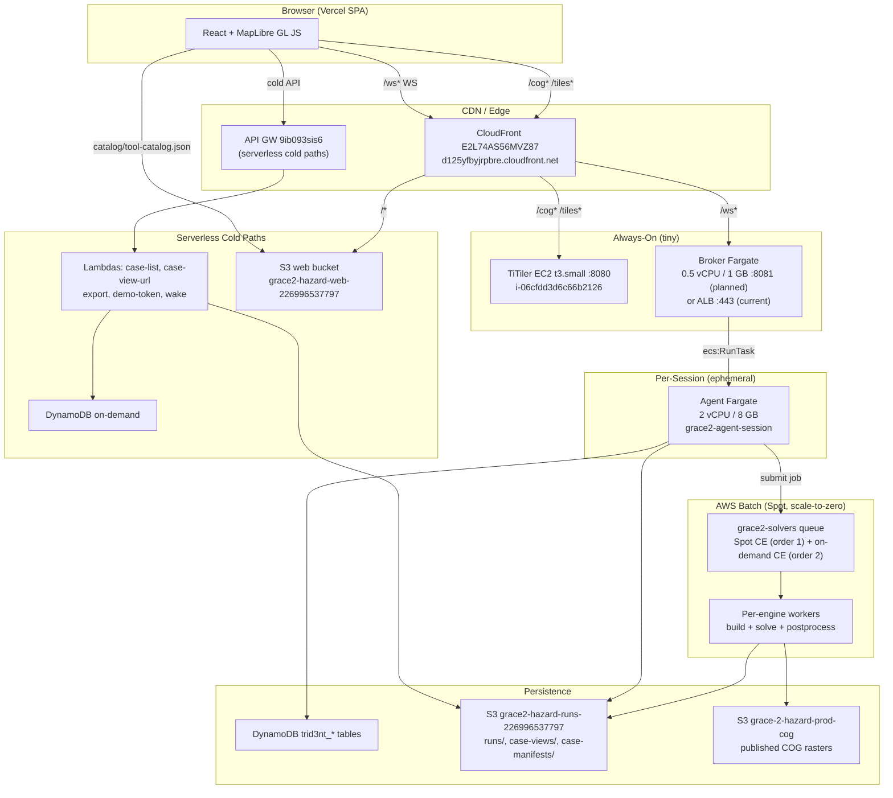
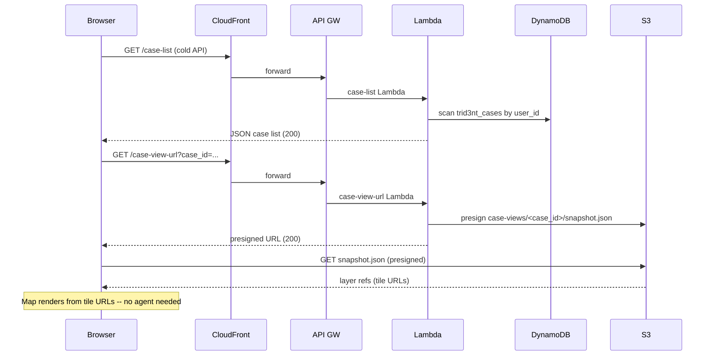
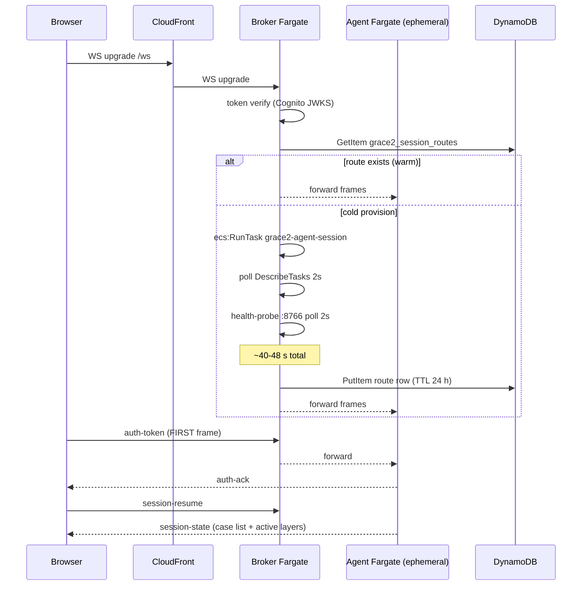
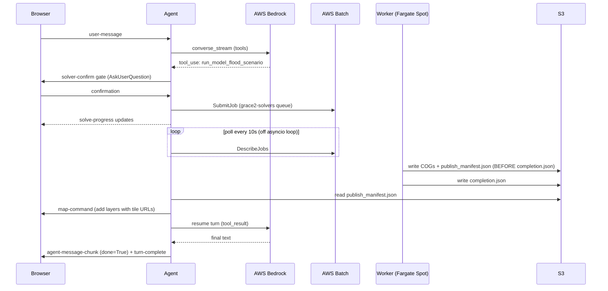

# Architecture Overview

Source of truth: `reports/design/scale-to-zero-architecture-2026-07-04.md` (live-verified 2026-07-04,
AWS account 226996537797, us-west-2).

---

## Tier diagram

---

## The three scale-to-zero islands

The architecture is built around three **independent** scale-to-zero islands that interoperate
without depending on each other:

| Island | Components | Idle cost | Scale mechanism |
|--------|-----------|-----------|-----------------|
| **Data / Render** | TiTiler EC2, S3, CloudFront, Lambdas, DynamoDB | ~$20/mo | TiTiler is the single always-on exception; everything else is truly serverless |
| **Agents** | Broker + per-session Fargate tasks | ~$32/mo today (target ~$15) | Broker always-on (cheap); agents torn down after 30 min idle via reaper + self-idle-exit |
| **Engines** | AWS Batch Spot CE, worker containers | ~$0 between jobs | Both CEs at min/desired vCPU = 0; RunTask only on solver submit |

**Key design principle:** the client can render cold case views -- map layers with no live agent -- by
reading snapshot URLs from S3 via signed URLs from the cold-path Lambdas. Only interactive chat and
new simulation runs require a live agent.

---

## Request lifecycles

### Cold view path (agent offline)

### Live session path (agent warm)

### Solve path

---

## Scale-to-zero migration phases

See `reports/design/scale-to-zero-architecture-2026-07-04.md` Section 2.6 for the full plan.

| Phase | Change | Savings |
|-------|--------|---------|
| 0 | Decommission stopped agent box + legacy Lambdas + orphan DynamoDB tables | ~$6/mo |
| 1 | Heartbeat-reaper: agent writes heartbeat to route row; reaper reads DynamoDB only; delete VPC interface endpoints | ~$29/mo |
| 2 | Move broker onto TiTiler t3.small; delete ALB + broker ECS service | ~$32/mo |
| 3 | Client hardening: route non-queued frame types through `sendOrQueue` | reliability |
| 4 | Agent diet: lazy imports, remove google-genai types dependency, Phase-2 fetcher offload; 8 GB -> 4 GB | ~4x session cost |
