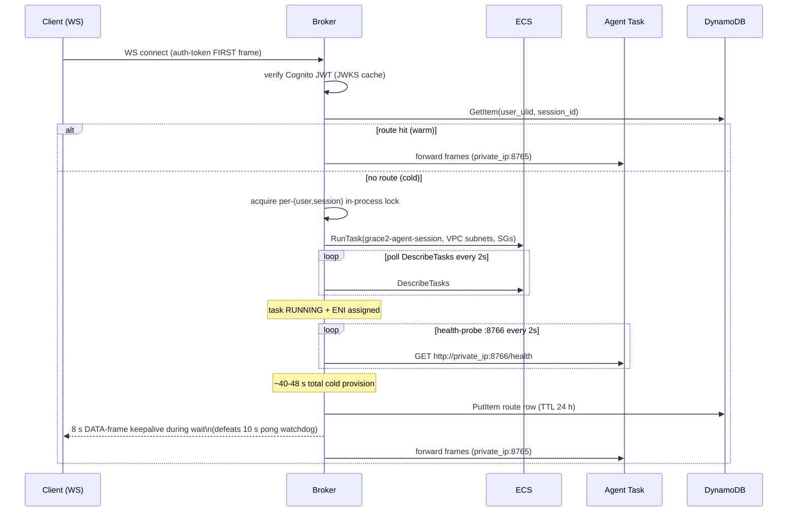
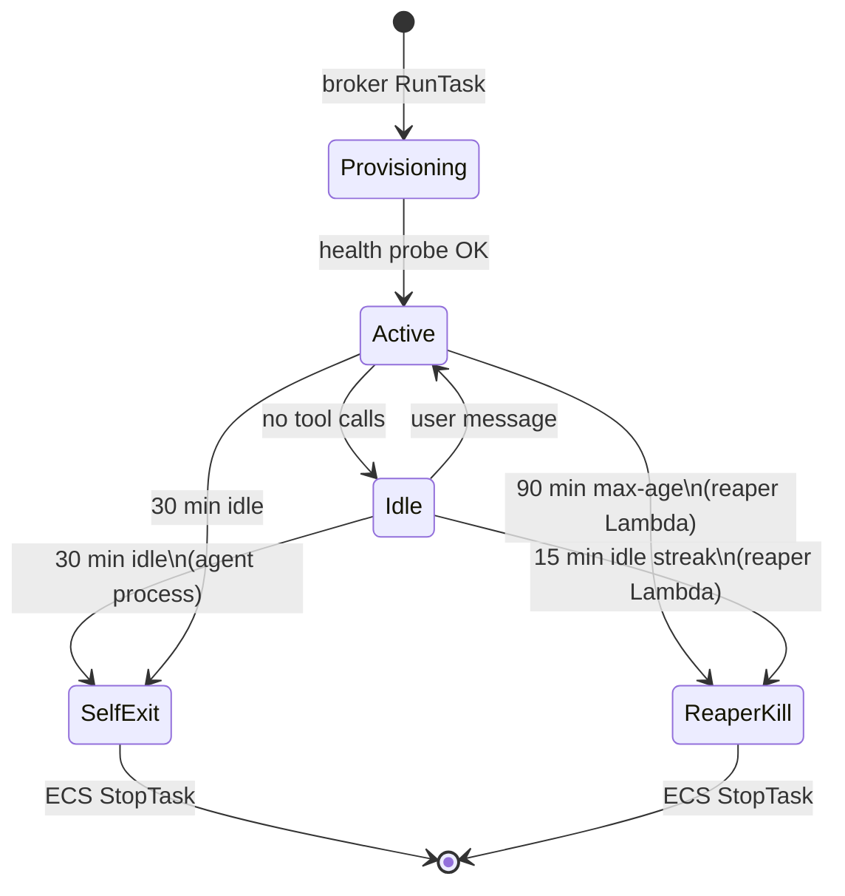

# Session Tier

The session tier manages the lifecycle of per-user WebSocket sessions and per-session agent tasks.

Source files: `infra/aws-agent-isolation/` (IaC), `infra/aws-agent-isolation/broker/app.py` (broker),
`infra/aws-agent-isolation/lambda/reaper.py` (reaper), `infra/aws-agent-isolation/RUNBOOK.md`.

---

## Component overview

```
CloudFront /ws*
    |
    v
ALB grace2-agent-broker (always-on, HTTP/WS :443)
    |
    v
Broker Fargate task (0.5 vCPU / 1 GB, desired_count=1, always-on)
  - token verify (Cognito JWKS, cached in-process)
  - route lookup: DynamoDB grace2_session_routes
  - cold provision: ecs:RunTask grace2-agent-session
  - bidirectional frame pump (two sockets open per session)
    |
    v (per session)
Agent Fargate task (2 vCPU / 8 GB, ephemeral, no ECS service)
  - asyncio WS :8765 + HTTP :8766
  - task family: grace2-agent-session
  - teardown: reaper + self-idle-exit + route-row TTL
```

---

## Route table

**Table:** `grace2_session_routes` (DynamoDB PAY_PER_REQUEST, PITR on, TTL 24 h)

| Attribute | Type | Notes |
|---|---|---|
| `user_ulid` | PK (String) | Cognito sub encoded as ULID |
| `session_id` | SK (String) | Client-generated session UUID |
| `task_arn` | String | ECS task ARN for the agent Fargate task |
| `private_ip` | String | Agent task private IP (probed at `:8766`) |
| TTL | Number | Route row expires 24 h after write |

In-process broker state: provisioning locks + JWKS cache only. A broker restart loses nothing;
reconnects re-resolve from the route table.

---

## Cold provision flow



!!! warning "Known fragility: stale route after crash"
    If an agent task crashes mid-session, the route row is not immediately removed. The broker
    will continue dialing the dead private IP for up to 5 minutes until the reaper tick cleans
    it. The fix (broker deletes route on failed dial) is tracked as a hardening item.

!!! warning "Known fragility: provision timeout mismatch"
    The broker's provision timeout is 90 s; the agent's ECS health startPeriod is 120 s.
    If the agent is slow to start, the broker times out before ECS declares it healthy.
    Target fix: raise broker provision timeout to 150 s.

!!! warning "Scale limit at desired_count=1"
    The dual-socket convergence (two concurrent connects for the same user+session) is guarded
    by an in-process lock. This is correct at `desired_count=1` but has a documented double-RunTask
    race at `desired_count>=2` because the conditional PutItem guard is not yet implemented.

---

## Teardown paths

An agent task is torn down by one of three independent mechanisms:

| Mechanism | Trigger | Implementation |
|---|---|---|
| **Self-idle-exit** | 30 min of no tool calls | `os._exit(0)` from idle monitor in agent process |
| **Reaper** | 15 min idle streak (3 ticks) OR 90 min max-age | Lambda `grace2-agent-task-reaper` on 5-min EventBridge schedule; HTTP-probes `:8766` per task |
| **Route-row TTL** | 24 h after route write | DynamoDB TTL; stale rows cleaned automatically |



---

## Reaper

**Lambda:** `grace2-agent-task-reaper`
**Schedule:** EventBridge 5-min cron
**State table:** `grace2-autostop-state` (idle-streak tracking)

The reaper:
1. Lists running ECS tasks in the `grace2-agents` cluster with family `grace2-agent-session`.
2. HTTP-probes each task's private `:8766` to check if the agent is idle.
3. Increments the idle streak counter (in `grace2-autostop-state`); reaps at streak >= 3 (15 min).
4. Also reaps tasks exceeding `max_age` (90 min) regardless of idle state.

!!! note "Reaper + Batch guard (current vs. target)"
    The current reaper is VPC-attached (to reach private agent IPs) and uses a GLOBAL Batch guard:
    any in-flight Batch solve job keeps ALL idle sessions alive -- not just the session that owns
    the job. The target redesign (Phase 1 migration) replaces HTTP probing with a DynamoDB
    heartbeat written by the agent every ~60 s, removes the VPC attachment, and gains per-session
    Batch guard. This also deletes both VPC interface endpoints (~$29/mo).

---

## Broker image size note

The current broker image is ~1.4 GB because it installs the full `grace2_agent` package for
zero-drift Cognito JWT verification reuse. This is identified as vastly oversized for what the broker
process actually does. A Go rewrite of the broker would yield ~15-20 MB RSS and ~15 MB image.
This is an optional fast-follow after the broker-onto-TiTiler-box migration (Phase 2).
