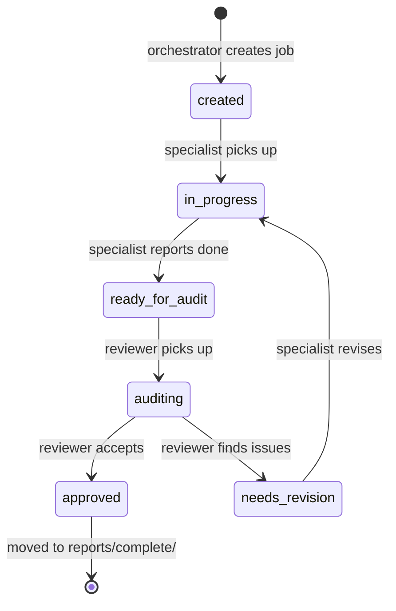

# Contributing

---

## Conventions (hard rules)

| Rule | Details |
|---|---|
| **ASCII hyphens only** | Never use em-dash (--) or en-dash (-) in commands, code, config, or tags. CLI flags are literal `--`. |
| **No emojis in UI** | Do not add emojis to UI code or commit messages unless explicitly requested. |
| **Commit per job** | Commit locally after each job; push to `origin/main` after each significant change. Never push without user say-so. |
| **Never edit `docs/SRS_v0.3.md` directly** | That file is regenerated from `docs/srs/*.md` by `make srs`. Amendments land in the narrow section file; run `make srs` to regenerate. |
| **Worktree isolation** | For parallel work: branch off `main`, work in `/tmp/grace2-<name>`, commit early. Never work in the shared main checkout when the orchestrator might be deploying. |
| **Never sync blocks the asyncio loop** | Wrap all boto3/file/network/compute calls in `asyncio.to_thread`. |
| **Mobile + desktop both tested** | Use `useIsMobile()` to gate mobile-specific fixes; leave the other env byte-for-byte unchanged. |

---

## Repository layout

```
GRACE-2/
  docs/                   Frozen SRS (docs/srs/*.md canonical; docs/SRS_v0.3.md generated)
  docs-site/              This documentation site (mkdocs.yml + docs/)
  agents/                 Orchestrator + specialist agent instructions
    AGENTS.md             Workflow conventions (read first)
    orchestrator.md       Orchestrator role + invariants + routing table
    schema.md             Schema specialist
    web.md                Web specialist
    agent.md              Agent specialist
    engine.md             Engine specialist
    infra.md              Infra specialist
    testing.md            Testing specialist
  infra/                  OpenTofu / Terraform IaC (one dir per stack)
    aws-agent-isolation/  Broker, agent ECS, ALB, reaper, route table
    aws-autostop/         TiTiler box autostop + CORS
    aws-batch/            Queue, compute environments, job definitions
    aws-codebuild/        Agent + worker build pipelines
    aws-ops-watchdog/     EventBridge Lambda watchdog
    aws-titiler/          TiTiler EC2 + CloudFront origins
  services/
    agent/                Agent process (asyncio, tools, Bedrock adapter)
      src/grace2_agent/   Python package
        server.py         Main WS server + protocol dispatch
        bedrock_adapter.py  Bedrock LLM adapter
        tools/            Tool registry (~160 tools)
          solver.py       Batch submit + poll
        dynamo_backend.py DynamoDB persistence
        publish_layer.py  Layer publication + TiTiler URL resolution
    workers/              Batch worker containers (one dir per engine)
      _raster_postprocess/  Shared rasterio + manifest helpers
      sfincs/             SFINCS v2.3.3
      sfincs_deckbuilder/ SFINCS coastal quadtree
      _sfincs_build/      SFINCS pluvial build
      modflow/            MODFLOW 6
      _modflow_build/     MODFLOW build + postprocess
      geoclaw/            GeoClaw 5.14.0
      openquake/          OpenQuake Engine
      landlab/            Landlab
      swan/               SWAN wave
      swmm/               PySWMM
      canopy/             Canopy ML
  web/                    React + MapLibre GL JS SPA
    src/
      ws.ts               WebSocket client
  scripts/
    deploy_agent_bundle.sh  Agent deploy step 1 (bundle + upload)
    ops_health_check.sh     Ops 7-probe health check
  reports/
    PROJECT_STATE.md      Current truth (stack, contracts, environment facts)
    PROJECT_LOG.md        Append-only change log
    inflight/             Active jobs (work queue)
    complete/             Immutable completed jobs
    design/               Design documents
    sprints/              Sprint manifests
```

---

## The job system (orchestrator / specialists)

All engineering work flows through a structured job system. Understand this before submitting
changes.

### Agents and routing

The **orchestrator** (`agents/orchestrator.md`) never writes application code. It routes work to
**6 specialists**:

| Specialist | Domain |
|---|---|
| `schema` | Contracts, WebSocket protocol, shared types (grace2_contracts) |
| `web` | React + MapLibre GL JS client |
| `agent` | Agent service, tool registry, WS server, MCP |
| `engine` | Hazard engines, workers, composers, solvers |
| `infra` | AWS IaC (OpenTofu), ECR, CI |
| `testing` | Test harnesses, acceptance criteria, NFR verification |

### Job lifecycle

```
orchestrator creates job
    |
    v
reports/inflight/<job-id>/
  audit.md          Frozen kickoff (immutable once handed to specialist)
  STATE             Current state: created | in-progress | ready-for-audit | auditing | approved | needs-revision
  report.md         Specialist's completion report
  .history/         Version history

    |
    v (specialist runner executes)
    |
    v (adversarial reviewer gates at every dependency edge)
    |
    v
orchestrator audits -> approved
    |
    v
reports/complete/<job-id>/   (immutable; never edit)
PROJECT_LOG.md (append-only)
```

**Job ID format:** `job-NNNN-<specialist>-YYYYMMDD`

**Kickoffs are frozen** once handed to a specialist. New directives go in the next job. You cannot
amend a kickoff while it is in-flight.

### State machine



---

## How to add a tool

1. Create a new `.py` file in `services/agent/src/grace2_agent/tools/`.
2. Decorate with `@register_tool`:
   ```python
   @register_tool(
       name="my_tool",
       description="...",
       schema={...},           # JSON Schema for the tool's parameters
       cacheable=True,
       ttl_class="short",
       source_class="data_fetch",
       primary_category="data_fetch",
   )
   async def my_tool(param: str) -> dict:
       ...
   ```
3. Heavy sync operations (rasterio, network, boto3): use `asyncio.to_thread` or add the tool
   to `_ALWAYS_OFFLOAD_SYNC_TOOLS` in `server.py`.
4. If the tool triggers a confirmation gate: add it to `SOLVER_CONFIRM_TOOLS` or
   `FETCH_CONFIRM_TOOLS` in `server.py`.
5. Redeploy the agent bundle and run a live smoke test.

---

## How to add an engine

1. **Worker container:** create `services/workers/<engine>/` with:
   - `Dockerfile` (minimal base, multi-stage if needed)
   - `entrypoint.py` or `entrypoint.sh` that reads `job_spec.json` from S3, runs
     build + solve + postprocess, and writes `publish_manifest.json` (BEFORE `completion.json`)
     and `completion.json` to `s3://grace2-hazard-runs-226996537797/runs/<run_id>/`.
   - Follow the [Worker Contract](reference/worker-contract.md) exactly.

2. **Batch job definition:** add to `infra/aws-batch/` and reference the new ECR repo.

3. **Solver key:** add to `SOLVER_WORKFLOW_REGISTRY` in
   `services/agent/src/grace2_agent/tools/solver.py`.

4. **Job def env var:** set `GRACE2_AWS_BATCH_JOB_DEF_<SOLVER>` or use the in-code registry.

5. **Composer tool:** register a tool in the agent (see above) that:
   - Validates inputs (AOI bbox, forcing parameters)
   - Composes and stages `job_spec.json` to S3
   - Calls `run_solver(solver_key, job_spec, compute_class)`
   - Polls via the solver poll loop

6. **Live E2E test:** drive the new engine with **Haiku** on a **small AOI** before deploying to
   production. Confirm `publish_manifest.json` presence and tile rendering.

---

## 10 Architectural Invariants

From `agents/orchestrator.md`:

1. **Determinism boundary** -- the LLM never produces numerical output; it only selects and
   parameterizes tools.
2. **Deterministic workflows** -- engine workflows are Python functions; no intent-classification
   phase inside a workflow.
3. **Engine registration, not modification** -- all engines share the interface
   `(location, forcing) -> AssessmentEnvelope`.
4. **Rendering through QGIS Server** -- `.qgs` + QML via WMS/WMTS/WFS (target state for vector
   layers; rasters via TiTiler today).
5. **Tier separation** -- basemap data from public providers; model outputs via QGIS Server / TiTiler
   only.
6. **Metadata-payload pattern** -- DynamoDB for discovery; S3 for large payloads.
7. **Claims carry provenance** -- `NumericClaim` in `ClaimSet` with consensus.
8. **Cancellation is first-class** -- end-to-end within 30 s.
9. **Confirmation before consequence** -- no cost theater; all high-consequence tools gate.
10. **Minimal parameter surface** -- fetch everything with an authoritative source; never ask the
    user for something the system can derive.
