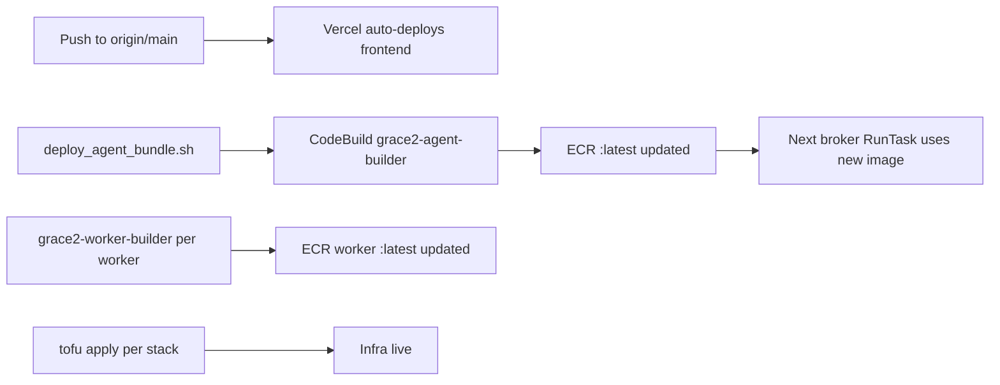

# Deploy

Each tier deploys independently. There is no monolithic deploy pipeline.

---

## Web frontend (Vercel)

**Trigger:** push to `origin/main`
**No manual step needed.** Vercel auto-deploys on every push via `web/vercel.json` (Vite build).

```bash
git push origin main   # Vercel picks this up automatically
```

Env vars for the frontend are managed in the Vercel dashboard. Do NOT `aws s3 sync` the frontend --
that targets the legacy dead S3 bucket, not Vercel.

---

## Agent (Fargate)

New per-session agent tasks pick up the `:latest` ECR image automatically on the next provision.

**Two-step process:**

### Step 1: Bundle + upload (dev machine)

```bash
bash scripts/deploy_agent_bundle.sh
```

This script:
1. Tars `services/agent/src/grace2_agent/`, `services/agent/src/grace2_contracts/`,
   `python_sandbox/executor.py`, and `workers_modflow/gwt_adapter.py`.
2. Uploads the bundle to `s3://grace2-agent-bundle-226996537797/engine-build/agent_deploy_src.tgz`
   with a sha256 sidecar.
3. Publishes `catalog/tool-catalog.json` to the web bucket (`grace2-hazard-web-226996537797`)
   as public-read, `max-age=300`. (Skip with `GRACE2_SKIP_COLD_CATALOG=1`.)

### Step 2: Build image (CodeBuild)

AWS CodeBuild project `grace2-agent-builder` pulls the bundle from S3, builds a Docker image,
and pushes to ECR `:latest`. The IaC lives in `infra/aws-codebuild/`.

```bash
# Trigger the build (CodeBuild picks up the bundle automatically, or trigger manually)
aws codebuild start-build --project-name grace2-agent-builder --region us-west-2
```

New sessions provision the updated image automatically. There is no need to drain or restart
the broker; the broker calls `ecs:RunTask` with the task definition that references `:latest`.

!!! note "Standing deploy authorization"
    NATE has granted standing authorization for agent code deploys. No per-deploy confirmation
    is needed. See memory entry `project_agent_deploy_via_custom_ssm_doc.md`.

---

## Workers (Batch)

Each worker has its own CodeBuild project triggered by `WORKER_DIR` and `ECR_REPO` overrides:

```bash
aws codebuild start-build \
  --project-name grace2-worker-builder \
  --environment-variables-override \
    name=WORKER_DIR,value=services/workers/sfincs_deckbuilder,type=PLAINTEXT \
    name=ECR_REPO,value=<ecr_repo_uri>,type=PLAINTEXT \
  --region us-west-2
```

Workers use `:latest` mutable tags. Digest pinning is a TODO (see
`reports/design/scale-to-zero-architecture-2026-07-04.md` section 1.6).

**Container hygiene norm:** before any ECR push, inspect size + `docker history` + build context.
Use multi-stage builds, minimal base images, and `.dockerignore`. Report size/layer breakdown.

---

## Infra (OpenTofu / Terraform)

Each infra stack is in a separate `infra/<stack>/` directory with its own `versions.tf` backend:

| Stack | Directory | Notes |
|---|---|---|
| Session isolation (broker, agent ECS, ALB) | `infra/aws-agent-isolation/` | Main live stack |
| TiTiler EC2 | `infra/aws-titiler/` | Always-on tiles box |
| Auto-stop (legacy idle check) | `infra/aws-autostop/` | CORS, autostop Lambda (superseded by broker/reaper) |
| AWS Batch | `infra/aws-batch/` | Queue, CEs, job defs |
| CodeBuild | `infra/aws-codebuild/` | Build pipelines |
| Ops watchdog | `infra/aws-ops-watchdog/` | EventBridge Lambda watchdog |

```bash
cd infra/aws-agent-isolation
tofu init
tofu plan
tofu apply    # requires explicit NATE confirmation for live mutations
```

**Gate flags** controlling feature behavior are env vars set in `infra/aws-agent-isolation/ecs.tf`
(e.g. `GRACE2_DYNAMO_TABLE_PREFIX=trid3nt_`, `AUTH_REQUIRED=true`, `GRACE2_SOLVER_BACKEND=aws-batch`).

---

## Cold tool catalog

The tool catalog is published as a static JSON during the agent bundle deploy:

```
s3://grace2-hazard-web-226996537797/catalog/tool-catalog.json
  Cache-Control: max-age=300
  ACL: public-read
```

The web client reads this cold-first (no agent wake needed) to display tool descriptions. The agent
also serves the same catalog at `/api/tools` (CloudFront -> agent :8766) when the agent is live.

---

## Deployment sequence for a full-stack change

For changes touching agent code, worker code, and infra simultaneously:



Steps B, C/D/E, G/H, and I are all independent and can run in parallel.
