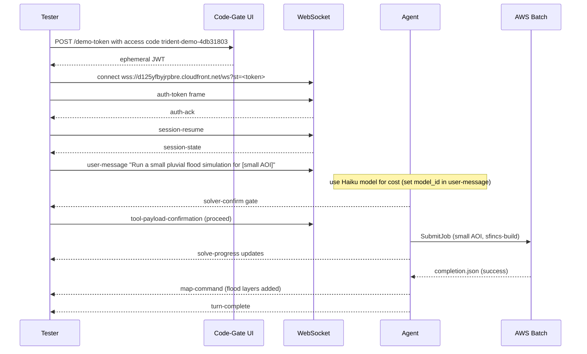

# Verification

Every deployed change requires live end-to-end verification. Tests alone are not sufficient:
several bugs (S3 CORS blocks, React hook-after-early-return crashes, WS heartbeat stalls) were
only caught by live verification, not by the test suite.

---

## The live-verify norm

- **NATE tests live.** Playwright is not used for live verification (scrapped; see project memory).
- The post-change smoke test is the canonical E2E gate.
- Every job demands live E2E evidence before closure.
- "Works in tests, fails live in browser" -- suspect CORS first (S3 CORS root cause 2026-06-22).

---

## Post-change flood smoke test

For any change touching the agent, workers, or infra, run this smoke sequence:



**Success criteria:**
- `auth-ack` received within 5 s
- `session-state` received (case list populated)
- Solver-confirm gate appears (agent correctly identified as a simulation request)
- Batch job progresses through RUNNABLE -> STARTING -> RUNNING -> SUCCEEDED
- `map-command` with flood depth layer received
- Tile URLs resolve in the browser (no 403, no blank tiles)
- `turn-complete` received

---

## Box-off cold-view check

Verify that case views render without a live agent:

1. Disconnect from the live session (or wait for agent to idle-exit).
2. Reload the app at `https://d125yfbyjrpbre.cloudfront.net/app`.
3. Confirm the case list loads (cold Lambda path via API GW).
4. Select a case with previously rendered layers.
5. Confirm the layer panel populates and tiles render on the map -- no "spinning" state.

**What to check in DevTools Network tab:**
- Case list: `GET /case-list` returns 200 (Lambda, not WS).
- Case view: `GET /case-view-url` returns 200 with presigned URL; subsequent fetch of snapshot.json returns 200.
- No CORS errors (all S3 presigned fetches should have proper CORS headers from `infra/aws-autostop/cors.tf`).

---

## After a web deploy (Vercel)

Check for the React hook-order bug class (seen 2026-06-22): a hook placed after an auth
early-return in `App.tsx` crashes the authed app with a blank root. Vitest mounts the app
pre-authed and misses this. After every Vercel deploy:

1. Open `https://d125yfbyjrpbre.cloudfront.net/app` in an incognito window.
2. Sign in via Cognito Hosted UI.
3. Confirm the `/app` route renders (no blank root, no React #310 error).

---

## Mobile vs. desktop regression check

Any UI change must be tested on both mobile and desktop. Hard rule:
- Mobile fixes must be gated on `useIsMobile()` hook.
- The other env must be byte-for-byte unchanged.
- State target env in code comment, commit message, and subagent prompt.

Test matrix after any UI change:
- [ ] Desktop Chrome: layout correct, no new undefined behavior
- [ ] Mobile Chrome (DevTools device mode or real device): layout correct

---

## Env-specific smoke commands

```bash
# Check broker ALB target health
aws elbv2 describe-target-health \
  --target-group-arn <broker-tg-arn> \
  --region us-west-2

# Check running agent tasks
aws ecs list-tasks \
  --cluster grace2-agents \
  --family grace2-agent-session \
  --desired-status RUNNING \
  --region us-west-2

# Check recent Batch jobs
aws batch list-jobs \
  --job-queue grace2-solvers \
  --job-status RUNNING \
  --region us-west-2

# Check TiTiler health
curl https://d125yfbyjrpbre.cloudfront.net/tiles/healthz

# Tail agent logs
aws logs tail /ecs/grace2-agent-session --follow --region us-west-2
```

---

## Protocol for engine changes

When deploying a changed engine worker:
1. Build + push to ECR with the worker builder.
2. Drive a live test with **Haiku** (cheap) on a **small AOI** before confirming production.
3. Watch for `publish_manifest.json` presence in S3 before `completion.json`.
4. Confirm tile URLs in `map-command` resolve (no 403 from TiTiler).
5. Only then mark the job complete.
