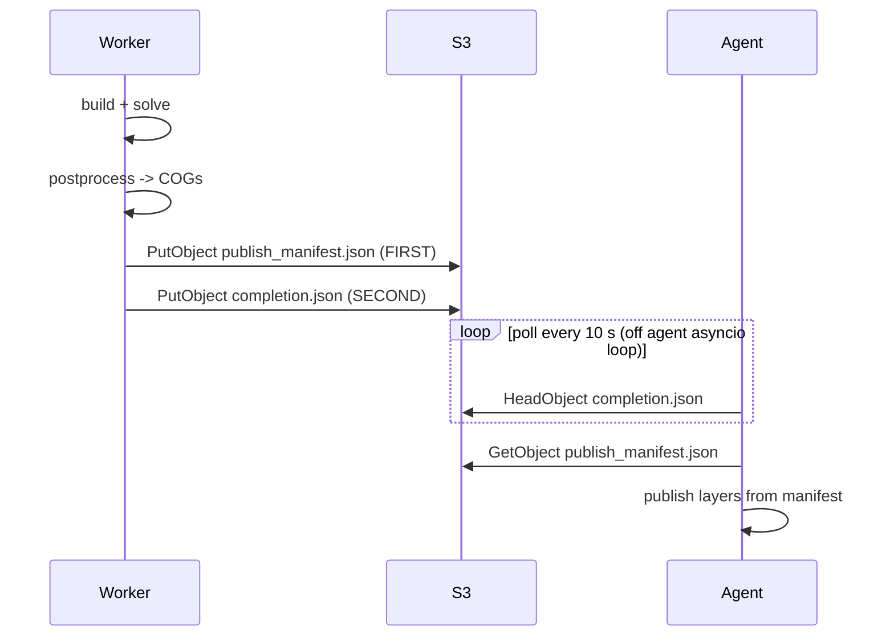

# Worker Contract

Every Batch worker must follow this contract exactly. The agent uses these files to determine
success/failure, extract layer references, and publish map tiles.

Source files: `services/workers/_raster_postprocess/manifest.py`,
`services/agent/src/grace2_agent/tools/solver.py`.

---

## Output location

All outputs land under a single S3 prefix:

```
s3://grace2-hazard-runs-226996537797/runs/<run_id>/
  publish_manifest.json   (written BEFORE completion.json)
  completion.json
  <engine_outputs>/       (COG rasters, NetCDF, logs, etc.)
```

The `<run_id>` is a ULID generated by the agent at submit time and passed to the worker via
environment variable or `job_spec`.

---

## Write ordering (Spot atomicity)



**Why manifest before completion:** if Spot reclaims the task after COGs are written but before
`completion.json` lands, the agent can still recover the layer references from the manifest. The
manifest-presence gate in the agent checks for `publish_manifest.json` first; `completion.json`
is the final signal to stop polling.

---

## `publish_manifest.json` schema (schema_version 1)

```json
{
  "schema_version": 1,
  "engine": "sfincs",
  "run_id": "<ulid>",
  "status": "ok",
  "frame_count": 144,
  "metrics": { ... },
  "layers": [
    {
      "layer_id_stem": "flood_depth",
      "name": "Flood Depth (m)",
      "layer_type": "raster",
      "role": "primary",
      "style_preset": "continuous_flood_depth",
      "units": "m",
      "cog_uri": "s3://grace-2-hazard-prod-cog/runs/<run_id>/flood_depth.tif",
      "frame_no": null,
      "bbox": [lon_min, lat_min, lon_max, lat_max],
      "has_overviews": true,
      "band_stats": {
        "min": 0.0,
        "max": 3.4,
        "mean": 0.12,
        "std": 0.31
      },
      "metrics": { ... }
    }
  ]
}
```

### Field reference

| Field | Type | Notes |
|---|---|---|
| `schema_version` | int | Must be `1`. Unknown version triggers in-agent postprocess fallback. |
| `engine` | string | Engine identifier (`sfincs`, `modflow`, `geoclaw`, etc.) |
| `run_id` | string | ULID; matches the S3 prefix |
| `status` | string | `"ok"` or `"error"` |
| `frame_count` | int | Number of time-step frames (1 for steady-state) |
| `metrics` | object | Engine-specific scalar outputs (peak discharge, max depth, etc.) |
| `layers` | array | List of layer entries (see below) |
| `error_code` | string | Present only when `status="error"` (see honesty floor) |

### Layer entry fields

| Field | Type | Notes |
|---|---|---|
| `layer_id_stem` | string | Stable ID base; agent appends suffix for multi-frame layers |
| `name` | string | Display name shown in the layer panel |
| `layer_type` | string | `"raster"` (default) or `"vector"` |
| `role` | string | `"primary"`, `"secondary"`, `"background"` |
| `style_preset` | string | Rendering preset key (e.g. `"continuous_flood_depth"`) |
| `units` | string | Display units (e.g. `"m"`, `"m/s"`, `"mm"`) |
| `cog_uri` | string | **Bare `s3://` URI** -- the agent resolves to a signed URL or TiTiler URL at publish time |
| `frame_no` | int or null | Frame index for time-stepped outputs; null for steady-state |
| `bbox` | [float, float, float, float] | `[lon_min, lat_min, lon_max, lat_max]` WGS84 |
| `has_overviews` | bool | `true` if COG overviews are included (default `true`) |
| `band_stats` | object | `{min, max, mean, std}` |
| `metrics` | object or null | Per-layer scalar metrics |

!!! warning "COG URI must be s3:// at write time"
    Workers write bare `s3://` URIs to the manifest. The agent converts these to TiTiler tile URLs
    or presigned URLs at publish time. Never write `https://` URLs directly into the manifest --
    they are not re-signable on reconnect.

---

## `completion.json` schema

```json
{
  "status": "ok",
  "run_id": "<ulid>",
  "engine": "sfincs",
  "elapsed_s": 143.2,
  "error_code": null,
  "deck_provenance": {
    "grid_cells": 12800,
    "compute_class": "standard",
    "job_def": "grace2-sfincs-quadtree:5"
  }
}
```

| Field | Notes |
|---|---|
| `status` | `"ok"` or `"error"` |
| `run_id` | ULID |
| `engine` | Engine identifier |
| `elapsed_s` | Wall time for the Batch task |
| `error_code` | Typed error code on failure (see honesty floor) |
| `deck_provenance` | Engine-specific build metadata for auditing |

---

## Honesty floor

A manifest with `status="ok"` but no actual COG layers is **forbidden**. If the engine produced
no useful output, the worker must write `status="error"` with a typed `error_code`:

| Error code pattern | Meaning |
|---|---|
| `*_OUTPUT_EMPTY` | Engine ran to completion but produced zero output cells/points |
| `*_SOLVE_FAILED` | Numerical solver returned non-zero exit code |
| `*_BUILD_FAILED` | Model deck construction failed before solve |
| `*_POSTPROCESS_FAILED` | Solve succeeded but rasterization failed |

The agent rejects any manifest with `status="ok"` and an empty `layers` array and reports a typed
error to the user. This prevents silent successes that display blank map tiles.

---

## Manifest-presence gating and in-agent fallback

The agent's manifest-reading path:

1. Poll `completion.json` every 10 s (off the asyncio loop via `asyncio.to_thread`).
2. On `completion.json` present: read `publish_manifest.json`.
3. If `publish_manifest.json` present with valid `schema_version=1`: publish layers from manifest.
4. If `publish_manifest.json` absent OR `schema_version` unknown: trigger in-agent postprocess
   fallback (legacy path -- reads raw solver outputs and builds layer refs locally).

The fallback exists for backwards compatibility with workers that predate the manifest contract.
New workers must produce `publish_manifest.json`.

---

## Job spec staging

The agent composes a `job_spec` JSON object and passes it to the worker via S3 (staging key
`runs/<run_id>/job_spec.json`) and/or Batch job environment variables. The job spec contains:

- Input data URIs (DEM, landcover, forcing, boundary conditions)
- Simulation parameters (resolution, duration, storm params)
- Output S3 prefix (`s3://grace2-hazard-runs-226996537797/runs/<run_id>/`)
- Compute class hint

The worker reads the job spec at startup, executes the full pipeline, and writes outputs to the
specified prefix. It never calls back to the agent during execution.
