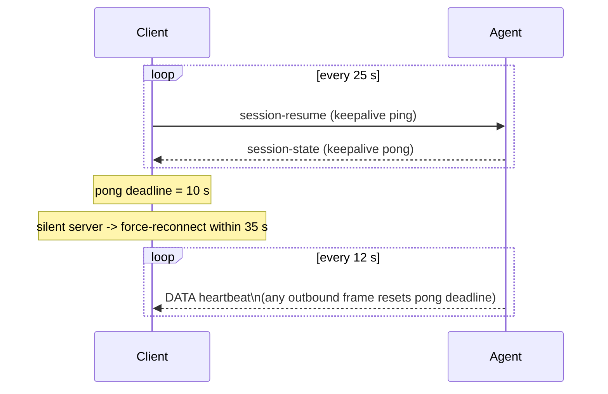

# WebSocket Protocol

The agent and client communicate over a single persistent WebSocket. All frames are JSON envelopes.

Source files: `services/agent/src/grace2_agent/server.py` (server side),
`web/src/ws.ts` (client side).

---

## Connection handshake

### URL format

```
wss://d125yfbyjrpbre.cloudfront.net/ws?sid=<sessionId>&st=<idToken>
```

Both parameters are query params -- **not** a WebSocket subprotocol. Chromium drops oversize
subprotocol headers for JWT-length values; the `?st=` query param pattern avoids this.

| Param | Value |
|---|---|
| `sid` | Client-generated session UUID (persisted in `localStorage` as `grace2.session_id`) |
| `st` | Cognito ID token (JWT) |

### Frame order on every connect

```
1. auth-token   (MUST be the first frame; gate rule)
2. session-resume
3. (flush outbound queue)
```

If `AUTH_REQUIRED=True` (live production) and the auth-token frame fails, the server closes the
socket with code `4401` and emits an `AUTH_FAILED_ERROR_CODE` error envelope first.

### Auth-token wire payload

```json
{
  "type": "auth-token",
  "session_id": "<uuid>",
  "payload": {
    "token": "<cognito_id_token_or_empty_string>",
    "anonymous": false,
    "anonymous_user_id": "<sticky_hint_or_undefined>"
  }
}
```

On success the server replies with `auth-ack`.

---

## Envelope schema

Every frame (both directions) is a JSON object:

```json
{
  "type": "<msg_type>",
  "session_id": "<uuid>",
  "payload": { ... }
}
```

---

## Client -> server message types

| `type` | When to send | Key payload fields |
|---|---|---|
| `auth-token` | First frame on every connect | `token`, `anonymous`, `anonymous_user_id` |
| `session-resume` | Second frame; also used as keepalive ping every 25 s | `case_id` (optional) |
| `user-message` | User submits a prompt | `text`, `research_mode`, `model_id` (optional), `case_id` |
| `cancel` | User cancels in-flight turn | `reason` (optional string) |
| `case-command` | Case CRUD operations | `command` (`CaseCommand`), `case_id`, `args` |
| `layer-delete` | Remove a layer | `envelope_type: "layer-delete"`, `layer_id` |
| `secret-add` | Store a credential in the vault | `envelope_type: "secret-add"`, `provider`, `case_id`, `label`, `key_value` |
| `secret-revoke` | Soft-revoke a credential | `envelope_type: "secret-revoke"`, `secret_id` |
| `credential-provided` | User answers a credential-request | `envelope_type: "credential-provided"`, `request_id`, `secret_id`, `provided` |
| `tool-payload-confirmation` | User confirms/cancels/narrows a payload warning | `warning_id`, `decision` (`"proceed"`, `"cancel"`, `"narrow_scope"`), `revised_args` (only on `narrow_scope`) |
| `region-choice-provided` | User chooses a geocoded region | `request_id`, `choice` (`"region"`, `"whole_state"`), `selected_region_id`, `selected_bbox` |
| `spatial-input-response` | User draws geometry on the map | `request_id`, `geometry_type` (`"point"`, `"bbox"`, `"vector_draw"`, or `null`), `coordinates`, `features`, `cancelled` |
| `mode2-add-confirmed` | User confirms adding an unregistered data source | `candidate_id`, `url`, `domain`, `suggested_tool_kind` |
| `mode2-audit-event` | Client-side telemetry | (see ws.ts) |

---

## Server -> client message types

| `type` | When emitted | Key payload fields |
|---|---|---|
| `auth-ack` | After successful auth handshake | session confirmed |
| `session-state` | On session-resume; also keepalive reply | full case list, active layers, pending gates replayed |
| `agent-message-chunk` | Streaming LLM text delta | `text`, `done` (bool), `turn_id` |
| `turn-complete` | End of every LLM turn | `case_id`, `turn_id` |
| `pipeline-state` | Tool card state update; cancel confirmation | `steps` (list of `PipelineStep`) |
| `error` | Protocol/auth/tool errors | `error_code`, `message`, `retryable` |
| `case-list` | After connect + after any case mutation | list of `CaseSummary` |
| `case-open` | After case select or create | `CaseSessionState` |
| `secrets-list` | On connect + after vault mutations | list of vault entries |
| `credential-request` | Agent tool needs a missing credential | `request_id`, `provider`, `label` |
| `tool-payload-warning` | Tool args exceed size threshold | `warning_id`, `tool_name`, `size_bytes`, `threshold_bytes` |
| `region-choice-request` | Geocode resolved to multiple candidates | `request_id`, list of `RegionCandidate` |
| `spatial-input-request` | Agent needs user-drawn geometry | `request_id`, `geometry_type`, `prompt` |
| `map-command` | Add/update/remove map layers | `command`, layer spec with tile URLs |
| `solve-progress` | During heavy solver run | `run_id`, `phase`, `pct_complete` |
| `impact-envelope` | After `compute_impact_envelope` | impact metrics |
| `chart-emission` | After chart-generation tool | chart spec |
| `code-exec-request` | Before sandbox dispatch | `request_id`, code preview |
| `code-exec-result` | After sandbox returns | output, artifacts |
| `mode2-candidate` | Classifier found an unregistered data source | `candidate_id`, `url`, `domain` |
| `tool-io` | Raw args + function_response per step (debug) | `tool_name`, `args`, `result` |

---

## Keepalive contract



| Parameter | Value | Source |
|---|---|---|
| Client ping interval | 25 s | `KEEPALIVE_INTERVAL_MS = 25_000` in ws.ts |
| Client pong deadline | 10 s | `KEEPALIVE_PONG_TIMEOUT_MS = 10_000` in ws.ts |
| Server DATA heartbeat | 12 s | agent server per-connection coroutine |
| Reconnect floor | 1500 ms | ws.ts reconnect backoff |
| Reconnect ceiling | 5000 ms | ws.ts reconnect backoff |

**The agent's 12 s DATA heartbeat satisfies the client's 10 s pong deadline.** The 35 s force-
reconnect window (25 s ping + 10 s pong) is wider than the 12 s server heartbeat interval,
so a healthy connection never triggers a spurious reconnect.

---

## Reconnect semantics

On reconnect the client:
1. Sends `auth-token` (first frame).
2. Sends `session-resume` with the last-known `case_id`.
3. Flushes the outbound queue.

The agent responds with `session-state` which replays: case list, active layers, any pending
confirmation/credential/region/spatial gates (re-emitted so mid-wake answers are not lost on the
server side -- see hardening gap below).

### Known hardening gap

The following client -> server frame types are **NOT queued** in the current `ws.ts` implementation.
If the socket is not `OPEN` when these are sent (e.g. mid-wake), they are silently dropped:

- `credential-provided`
- `region-choice-provided`
- `spatial-input-response`
- `tool-payload-confirmation`
- `layer-delete`
- `secret-add`
- `secret-revoke`

The server re-emits the gate requests on `session-resume`, but the user's answer is lost if the
socket closed between the user answering and the send. The fix (route these through `sendOrQueue`)
is tracked as Phase-3 client hardening.

---

## Session persistence

| Key | Storage | Notes |
|---|---|---|
| `grace2.session_id` | `localStorage` | Sticky session UUID; reused on reconnect |
| `grace2.anonymous_user_id` | `localStorage` | Sticky hint for anonymous sessions |

---

## Auth close codes

| Code | Meaning |
|---|---|
| `4401` | Auth failed; server closes the socket after emitting an `error` envelope |
